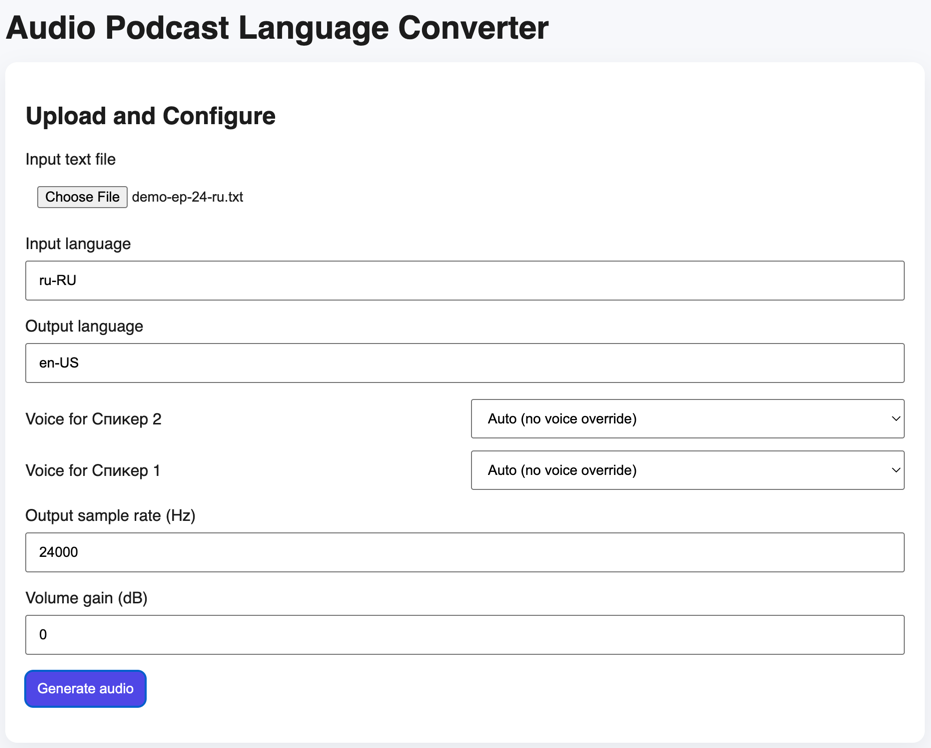

### Audio Podcast Language Converter

FastAPI web app that uploads a speaker-labeled text file, translates it with `gemini-2.5-pro`, prepares SSML (with supported markup), and generates MP3 audio output.

### Features
- Upload `.txt` input with speaker labels (e.g., `Спикер 1 00:00:09`).
- Translate from input language to output language via Gemini.
- Configure speaker-to-voice mapping, sample rate, and volume gain.
- Auto-detect intro segments, prepare SSML with non-speech/style tags, and save artifacts.
- Chunk long inputs when SSML exceeds the configured limit.



### Requirements
- Python `3.13`
- A Google API key with access to Gemini and Text-to-Speech

### Setup
```bash
python -m venv .venv
source .venv/bin/activate
pip install -r requirements.txt
```

Copy `.env.example` to `.env` and update values as needed.

### Environment Variables
- `GOOGLE_API_KEY` (required): Google API key.
- `APP_DATA_DIR` (optional, default `/data`): Base folder for uploads, artifacts, and audio.
- `MAX_SSML_CHARS` (optional, default `5000`): SSML length threshold for chunking.

The app loads variables from `.env` automatically (via `python-dotenv`).

If you do not have permissions for `/data`, set `APP_DATA_DIR=./data`.

### Start (recommended)
#### macOS/Linux
```bash
chmod +x start.sh
# Optionally rely on .env instead of exporting variables manually.
./start.sh
```

#### Windows (PowerShell)
```powershell
# Optionally rely on .env instead of exporting variables manually.
./start.ps1
```

### Start (manual)
```bash
# Optionally rely on .env instead of exporting variables manually.
uvicorn app.main:app --host 0.0.0.0 --port 8000 --reload
```

### Usage
1. Open `http://localhost:8000`.
2. Upload a `.txt` file (see `demo-data/demo-ep-24-ru.txt`).
3. Set input/output languages (defaults: `ru-RU` → `en-US`).
4. Provide available voices and map them to detected speakers.
5. Click **Generate audio** and download the MP3 result(s).

### Outputs
All outputs are stored under `APP_DATA_DIR`:
- `uploads/` — raw uploaded text files.
- `artifacts/` — prepared SSML (`*_prepared.ssml.txt`).
- `audio/` — generated MP3 files.